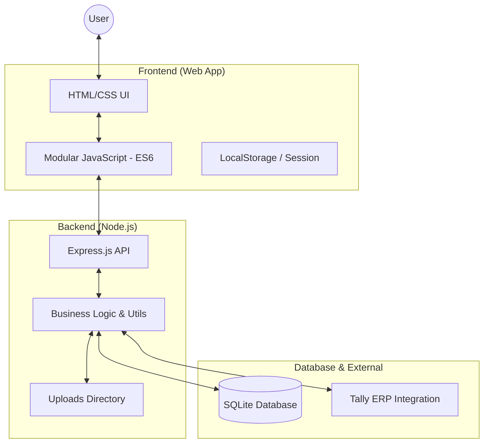

# Asset Manager v3.1 Architecture Overview

This document provides a high-level explanation of how the Asset Manager application is structured, how its components interconnect, and the overall data flow.

---

## 1. System Architecture (High Level)

The application follows a classic **Client-Server architecture** with a modular frontend and a lightweight backend.

---

## 2. Component Breakdown

### Frontend Modules (`/js`)
- **main.js**: The entry point. Initializes the app, handles authentication state, and manages top-level navigation.
- **dashboard.js**: Controls the primary workspace. Renders asset cards, statistics, and handles the "Home" and "Sheet" views.
- **hierarchy.js**: Manages the organizational structure. Builds the recursive tree for the sidebar and folders.
- **dataProcessor.js**: The "intelligence" for imports. Handles fuzzy column mapping when uploading Excel/CSV files.
- **auth.js**: Manages user login, session persistence, and module selection (IT, In-House, Rental, etc.).
- **qr.js**: Handles QR code generation for asset tagging and tracking.
- **itAssets.js**: Specialized view for IT-specific asset details (MAC, IP, Ports).

### Backend Services (`/web-app/asset-manager-backend`)
- **server.js**: The Express server. Defines all REST API endpoints for assets, folders, users, and audit logs.
- **utils.js**: Contains shared helper functions, database initialization logic, and the Tally XML integration bridge.

---

## 3. Key Interconnections & Workflows

### A. Asset Lifecycle Workflow
1. **Creation**: User adds an asset via the UI or Bulk Upload.
2. **Persistence**: Frontend sends a POST request to `/api/assets`.
3. **Storage**: Backend validates data and saves it to the SQLite `assets` table.
4. **Tracking**: A unique QR code is generated (via `qr.js`) for the asset ID.

### B. Bulk Import Workflow (The "Mapping" Engine)
1. **Upload**: User selects an Excel/CSV file.
2. **Analysis**: `dataProcessor.js` scans headers and suggests matches (e.g., "Serial No" -> "SrNo").
3. **Verification**: User confirms mappings in a preview modal.
4. **Batch Save**: Frontend sends the processed list to the backend in a single transaction.

### C. Delivery Challan (DC) Workflow
1. **Selection**: User searches and selects multiple assets in the "Create DC" view.
2. **Generation**: System bundles asset IDs and generates a PDF-ready manifest.
3. **Audit**: Backend creates a record in `delivery_challans` and logs the transaction in `audit_log`.

---

## 4. Technology Stack
- **Frontend**: HTML5, CSS3, Vanilla JavaScript (ES6 Modules), Tabulator (for grids), SheetJS (for Excel).
- **Backend**: Node.js, Express.js, Multer (for file uploads).
- **Database**: SQLite (via `better-sqlite3`).
- **Communication**: RESTful API (JSON).

---

## 5. Deployment Structure
The app is designed to run in two modes:
1. **Web Mode**: Hosted on a server (e.g., port 8080) for multi-user access.
2. **Electron Mode**: Packaged as a desktop application for local use with file system access.
